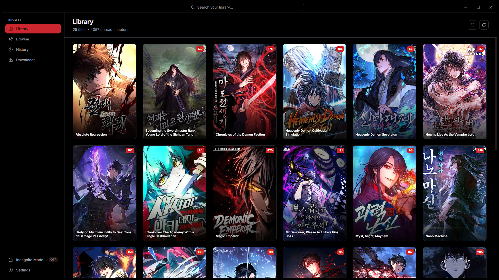
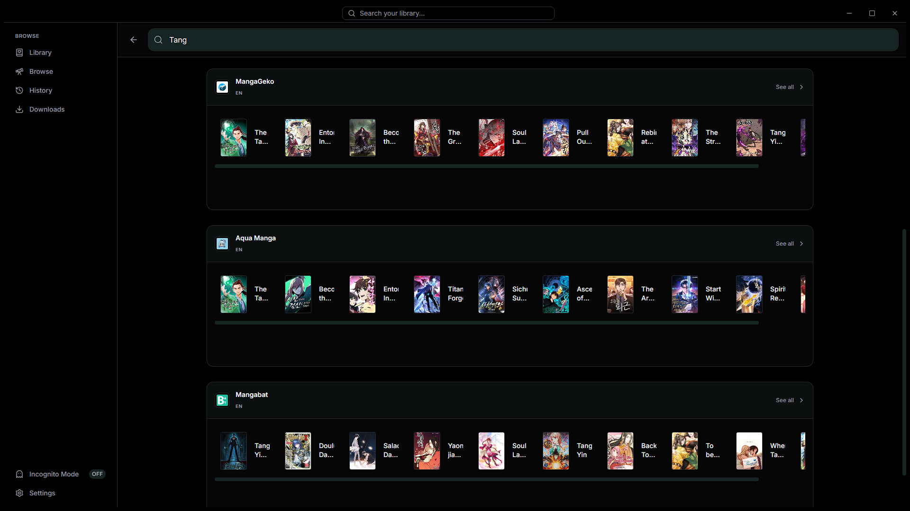

# MangaWin

MangaWin is a beautifully designed, modern Windows desktop client for reading manga, manhua, and webtoons. It serves as an elegant, native-feeling frontend powered by the robust **Suwayomi-Server** (Tachidesk) backend.

| Library | Global Search |
|---------|---------------|
|  |  |

## 📥 Download

Download the latest **Stable** or **Nightly (Beta)** `.exe` installer from the **[Releases Page](https://github.com/MAXglitchop/MangaWin/releases/latest)**!

---

## ✨ Features

- **Beautiful Native UI**: Built with React & Tailwind CSS for a fluid, dark-mode native experience with micro-animations.
- **Advanced Reader**: Fully customizable reading experience with both Paged (LTR/RTL) and Webtoon (Vertical scroll) modes, zoom & pan, brightness control, and smart-fit scaling.
- **Offline Reading**: Full offline support. Downloaded chapters are served locally bypassing internet requirements (and bypassing Chromium `ERR_INTERNET_DISCONNECTED` bugs).
- **Extension Support**: Browse, install, and update manga sources from the community Keiyoushi repository.
- **Library Management**: Organize your manga with categories, track reading progress, and auto-sync read states.
- **Self-Contained Executable**: Powered by Tauri. The app automatically downloads and manages its own background Java backend (Suwayomi), so users just run the `.exe` without installing Java manually.

---

## 🏗️ Architecture & Tech Stack

MangaWin follows a decoupled, three-tier architecture designed for performance and low resource usage:

1. **Frontend (Presentation Layer)**
   - **Framework**: React 18 with TypeScript and Vite
   - **Styling**: Tailwind CSS & Lucide React Icons
   - **State Management**: Zustand
   - **Data Fetching**: React Query (TanStack Query) + GraphQL Request
   - **Responsibility**: Provides the UI, handles user interactions, reading logic, and settings management.

2. **Bridge (Tauri Native Layer)**
   - **Framework**: Tauri v2
   - **Language**: Rust
   - **Responsibility**: Hosts the WebView2 browser window, handles OS-level file system access, dynamically manages the Suwayomi child process (spawning/killing), and acts as an HTTP proxy to route GraphQL queries when offline. Custom NSIS hooks are used to clean up AppData on uninstallation.

3. **Backend (Data & Network Layer)**
   - **Service**: Suwayomi-Server (Tachidesk)
   - **Language**: Java / Kotlin
   - **Responsibility**: Runs headlessly in the background (`CREATE_NO_WINDOW`). Handles web scraping, database management, library tracking, caching, and chapter downloading.

---

## 📂 Project Structure

```
MangaWin/
├── src/                    # Frontend React codebase
│   ├── components/         # Reusable UI components (buttons, cards, layout)
│   ├── hooks/              # Custom React Query hooks for API communication
│   ├── lib/                # Utilities, API clients, and Zustand stores
│   └── pages/              # Main application pages (Library, Discover, Reader, etc.)
├── src-tauri/              # Rust native backend
│   ├── src/                # Rust source code
│   │   ├── main.rs         # Tauri application entry point
│   │   └── server_manager.rs # Logic for managing the Suwayomi Java process & HTTP proxy
│   ├── tauri.conf.json     # Tauri configuration, window settings, and build info
│   └── installer_hooks.nsh # Custom NSIS uninstaller script
└── package.json            # Node.js dependencies and scripts
```

---

## 🛠️ Development Setup

### Prerequisites
- [Node.js](https://nodejs.org/) (v18 or newer)
- [Rust](https://www.rust-lang.org/tools/install)
- Visual Studio C++ Build Tools (for compiling Rust on Windows)

### Running Locally

1. **Clone the repository and install dependencies:**
   ```bash
   git clone https://github.com/yourusername/mangawin.git
   cd MangaWin
   npm install
   ```

2. **Start the development server:**
   ```bash
   npm run tauri dev
   ```
   *This will start the Vite frontend server and launch the Tauri native window.*

---

## 📦 Building for Production

To compile the application into a standalone Windows executable and a setup installer:

```bash
npm run tauri build
```

Once the build is complete, you can find the generated files in:
- **Standalone App**: `src-tauri/target/release/mangawin.exe`
- **Setup Installer**: `src-tauri/target/release/bundle/nsis/MangaWin_0.1.0_x64-setup.exe`

---

## 🔧 Deep Dive: Technical Q&A

**Why Tauri instead of Electron?**
Tauri uses the native OS webview (Microsoft Edge WebView2 on Windows), which results in a significantly smaller app size (often under 20MB), drastically reduced RAM usage, and native-level performance.

**How does MangaWin manage Suwayomi?**
On first launch, MangaWin downloads the Suwayomi-Server `.zip` (which bundles its own JRE) from GitHub and extracts it to `%APPDATA%/MangaWin/server`. Every time MangaWin starts, the Rust backend silently spawns `javaw.exe` as a child process. When MangaWin closes, it cleanly kills the process.

**Do you control the extension repository?**
**No.** MangaWin relies on the community-maintained Keiyoushi extension repository (`https://raw.githubusercontent.com/keiyoushi/extensions/repo/index.min.json`). We do not maintain or host any manga sources.

**Are you willing to modify Suwayomi source code?**
**No.** We treat Suwayomi as a black-box microservice. This ensures MangaWin can easily upgrade to future versions of Suwayomi without having to port custom Java modifications. We alter its behavior strictly through configuration files, CLI arguments, and its GraphQL API.

---

Copyright © 2026 Sayak Banerjee. All rights reserved.
